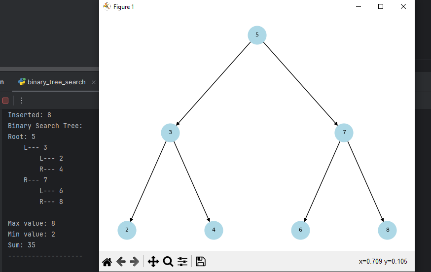
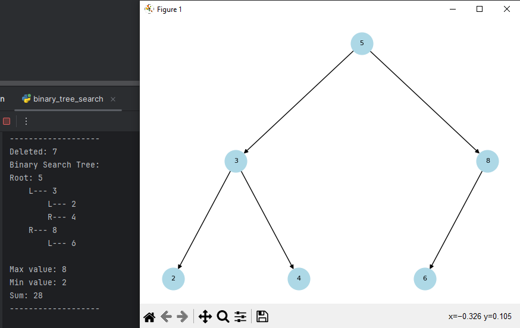
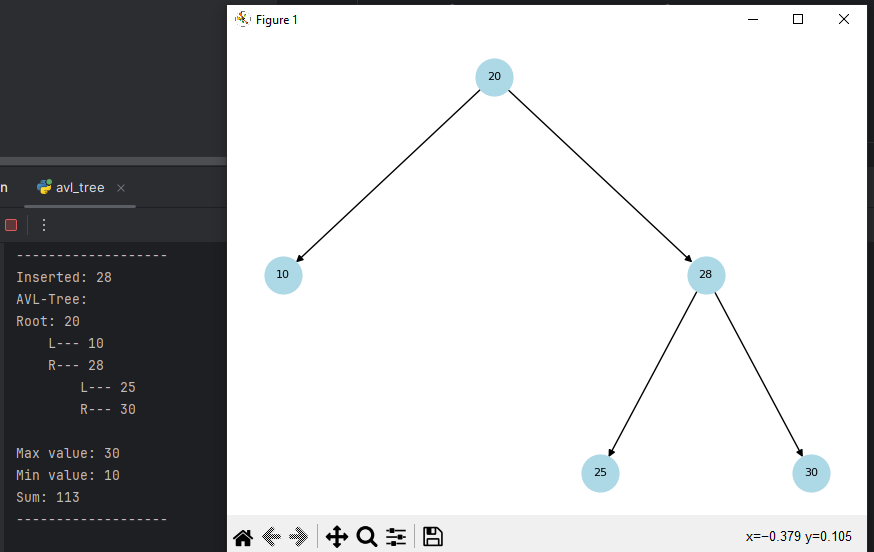
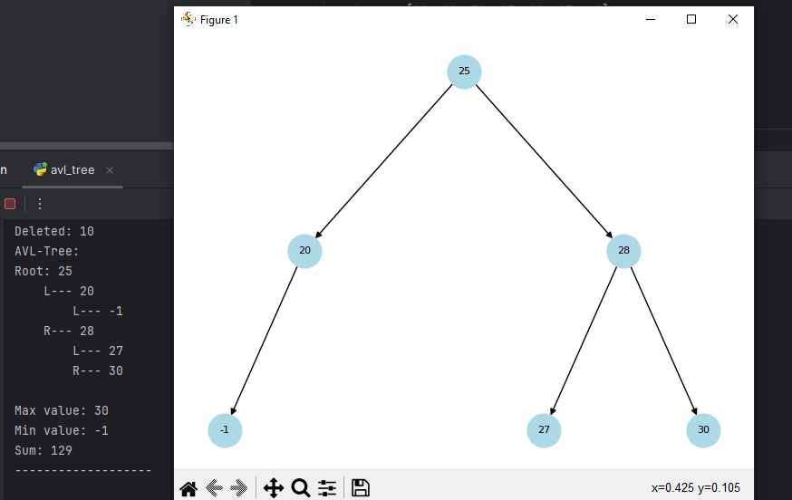

# goit-algo-hw-07

[Тема 7. Дерева та балансування](https://www.edu.goit.global/uk/learn/13571785/19646173/19658313/training)

# binary_tree_search

<h3>Insert</h3>

<h3>Delete</h3>

# avl_tree

<h3>Insert</h3>

<h3>Delete</h3>

